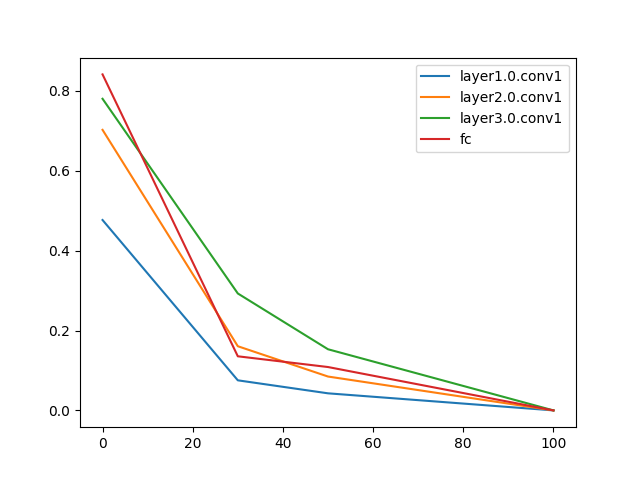

# CCA.pytorch

PyTorch implementation of 
* [**SVCCA: Singular Vector Canonical Correlation Analysis for Deep Learning Dynamics and Interpretability**](https://arxiv.org/abs/1706.05806) 
* [**Insights on representational similarity in neural networks with canonical correlation**](https://arxiv.org/abs/1806.05759)

# Requirements

* Python>=3.6
* PyTorch>=0.4.1
* torchvision>=0.2.1
* [homura](ttps://github.com/moskomule/homura) (to run `example.py`)
* matplotlib (to run `example.py`)

# Usage

```python
from cca import CCAHook
hook1 = CCAHook(model, "layer3.0.conv1")
hook2 = CCAHook(model, "layer3.0.conv2")
model.eval()
with torch.nograd():
    model(torch.randn(1200, 3, 224, 224))
hook1.distance(hook2, size=8) # resize to 8x8
```

# Example

`python example.py` trains ResNet-20 on CIFAR-10 for 100 epochs then measures CCA distance between a trained model and its checkpoints.



# Note

While the original SVCCA uses DFT for resizing, we use global average pooling for simplicity.